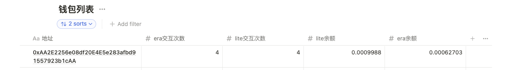

# 关于zksync_op_script

这个是借鉴了https://github.com/zksync-web3/zksync_script脚本，同时使用了官方的依赖库zksync-web3，并进行了改进。

# 如何使用

## 第一步安装

第一步安装依赖包

```shell
$ npm i
```

本项目的配置通过yaml文件进行配置，在根目录下面config.yml

```yaml
walletCount: 100 # 创建钱包的数量

okx: # ok交易所的相关配置
  api:
    key: 'xxx'
    secretKey: 'xxx'
    passPhrase: 'xxx'

lite: # zkysnc lite的相关配置
  mintNum: 1 # mintNFT的数量
  transferNumber: 0.0001 # 每次做转移的数量

notion: # notion相关的配置，所有钱包的状态会同步到notion笔记中
  token: 'xxx' # notion的token
  dbId: 'xxx' # 钱包统计的database的id
```

关于notion的统计数据库格式，可以参照这个notion笔记，https://www.notion.so/hightall/zksync-72513454041f4a3b88d63ecc2805df84?pvs=4

## 如何运行

### 1. 创建钱包

```she
$ npm run create-wallet
```


将会创建目录accounts，并在目录下创建基于日期时间的yml文件，保存所有的钱包信息，这里会把助记词也写到yaml文件中，格式如下

```yaml
ignore: true # 是否忽略这个私钥文件
wallets:
  - address: '0xF31A018Dcdfdb62Dc086D68757dffBB64689E4d1'
    privateKey: 'xxx'
    mnemonicPhrase: xx xx xx

```

### 2. 更新所有钱包信息并同步到notion数据库

```shell
$ npm run update-wallet-state
```

这个会获取所有钱包的era、lite的balance和nonce(交互次数)，并把所有的状态同步到notion数据库中。例如下图



如果想要使用notion记录数据，上面的property要一致，并且lite,era的交互次数和余额都是number类型。同时，必须要配置config.yml中的notion的相关配置。